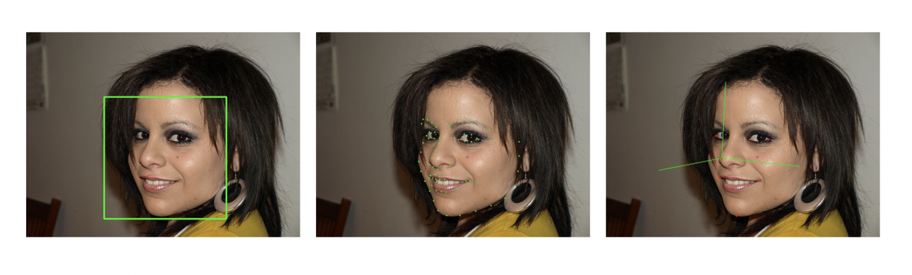

# Face Pose Estimation

## Introduction

Face Detection and Pose  Estimation using dlib and opencv.

This work is used to find frontal human faces in an image and estimate their pose.

You can download a trained facial shape predictor from  http://dlib.net/files/shape_predictor_68_face_landmarks.dat.bz2

  

## References

1. [Head Pose Estimation using OpenCV and Dlib](https://www.learnopencv.com/head-pose-estimation-using-opencv-and-dlib/)
2. [Dlib C++ Library](http://dlib.net/face_landmark_detection.py.html)